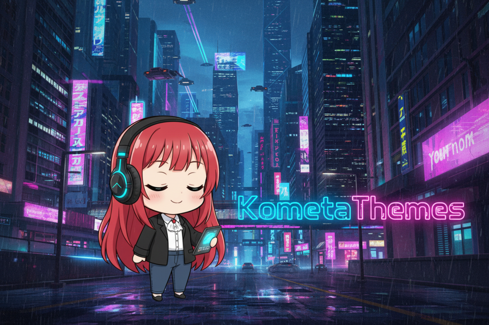

# KometaThemes



<p align="center">
  <a href="https://github.com/iCosiSenpai/KometaThemes/releases/latest"></a>
  
  
  
</p>

Anime openings and endings for [Jellyfin](https://jellyfin.org/), fetched automatically from [animethemes.moe](https://animethemes.moe). Multi-provider matching, multi-season handling, a guided Theme Finder UI, and first-class support for the Jellyfin 10.11.x theme playback quirks.

> 🇮🇹 La versione italiana è più in basso — [vai alla sezione italiana](#-italiano).

---

## Features

- **Automatic theme sync** — OP/ED audio (MP3) and video (WebM) for Series and Movies, on a schedule, on library add, or on demand.
- **Multi-provider resolution** — AniDB, AniList, MyAnimeList, Kitsu, AniSearch in configurable priority order, with a fuzzy title-search fallback (AnimeClick-friendly).
- **Multi-season aware** — season detection via multilingual regex and episode-range mapping; `AllPerSeason` mode downloads every theme of the detected season as a separate file for Jellyfin rotation.
- **Theme Finder** — guided 3-step wizard (search → pick anime → pick themes) with poster cards, audio/video preview, bulk selection and a live download log. Reachable from a ♪ button on every Series/Movie detail page.
- **Per-item management** — per-item page with downloaded/missing badges, one-click sync, delete, and **link repair** for the Jellyfin 10.11.x bug where theme files end up detached from their item (`ThemeLinkRepairService`).
- **Unresolved tracking** — items that fail to match or download land in a dedicated dashboard tab with per-item **Retry** and **Blacklist** actions; the cache tile links straight to it.
- **Activity log** — the dashboard shows the plugin's own entries from the live Jellyfin server log (INF/WRN/ERR, including stack traces), no SSH needed.
- **Resilient by design** — persistent JSON resolution cache with TTLs, token-bucket rate limiting, Polly retry + circuit breaker, parallel downloads, ffmpeg volume normalization.
- **Global playlist** — auto-maintained M3U with every downloaded theme, exportable from the dashboard.
- **Modern frontend** — premium dark design system, English/Italian UI, `Authorization: MediaBrowser` auth only (ready for Jellyfin 10.12+).

## Requirements

- **Jellyfin 10.11.x** (targetAbi 10.11.8.0).
- **[File Transformation](https://github.com/IAmParadox27/jellyfin-plugin-file-transformation)** plugin — required only for the ♪ Theme Finder button on item pages. KometaThemes uses it to inject its button script into the web client automatically. Everything else (sync, dashboard, Theme Finder page) works without it.

## Installation

1. In Jellyfin go to **Dashboard → Plugins → Repositories** and add:
   ```
   https://raw.githubusercontent.com/iCosiSenpai/iCosiSenpai-Plugins/main/manifest.json
   ```
2. Open **Catalog**, find **KometaThemes**, install it and restart Jellyfin.
3. (For the ♪ button) install the **File Transformation** plugin from the official Jellyfin catalog if you don't have it already, then restart.
4. Hard-refresh the dashboard afterwards (`Ctrl+Shift+R`).

### The ♪ Theme Finder button

Once the **File Transformation** plugin is installed, KometaThemes registers an injection automatically at startup — the ♪ button appears on every Series and Movie detail page (admins only), no manual configuration needed. The button script is served at `/Plugins/KometaThemes/ItemButton.js`; if you prefer to wire it up yourself, you can point any JavaScript injector at that URL instead.

## Configuration

The dashboard is organized in five tabs under a status hero (health, last sync, cache hit rate, skipped items — plus a live sync indicator):

| Tab | What's inside |
| --- | --- |
| **General** | UI language, library name pattern, sync interval, automation toggles (auto-sync on add, cleanup on remove, notifications) |
| **Themes & Download** | Audio/video settings for Series and Movies (fetch mode, volume, OP/ED filters), season detection, parallelism, force sync, dry-run |
| **Providers & Matching** | Provider priority list, title fallback + threshold, rate limit, resolution cache TTLs and stats |
| **Library** | Excluded items table with restore, playlist settings with refresh/export |
| **Unresolved** | Items that did not fetch, with reason, attempts, Retry / Blacklist / Dismiss |

### Example output

For "Attack on Titan" Season 1:

```
theme-music/
  OP1 - Guren no Yumiya__50.mp3
  OP2 - Jiyuu no Tsubasa__50.mp3
  ED1 - Utsukushiki Zankoku na Sekai__50.mp3
  ED2 - Great Escape__50.mp3
backdrops/
  OP1 - Guren no Yumiya__0.webm
```

## REST API

All endpoints require an elevated (admin) token.

| Endpoint | Method | Description |
|---|---|---|
| `/Plugins/KometaThemes/Health` | GET | Operational snapshot: version, cache, metrics, sync state |
| `/Plugins/KometaThemes/Sync/status` | GET | Live progress of the running sync |
| `/Plugins/KometaThemes/Sync/run` | POST | Start a preset sync (OP/ED/Video/All) |
| `/Plugins/KometaThemes/Items/{id}/sync?force=` | POST | Sync a single item (`force=true` bypasses the satisfied check) |
| `/Plugins/KometaThemes/Items/{id}/preview` | POST | Dry-run resolution for a single item |
| `/Plugins/KometaThemes/Items/{id}/themes` | GET/DELETE | List / delete downloaded themes |
| `/Plugins/KometaThemes/Items/{id}/repair` | POST | Re-link theme files to the item (10.11.x fix) |
| `/Plugins/KometaThemes/Failed/items` | GET | Unresolved/failed items list |
| `/Plugins/KometaThemes/Failed/items/{id}` | DELETE | Dismiss a failed item |
| `/Plugins/KometaThemes/Failed/clear` | POST | Clear the failed list |
| `/Plugins/KometaThemes/Skipped/{id}` | POST | Blacklist an item (never matched again) |
| `/Plugins/KometaThemes/Skipped/items` | GET | List blacklisted items |
| `/Plugins/KometaThemes/Skipped/{id}/remove` | POST | Restore a blacklisted item |
| `/Plugins/KometaThemes/Logs?lines=200` | GET | Plugin entries from the current server log |
| `/Plugins/KometaThemes/Cache/stats` · `/clear` | GET/POST | Resolution cache stats / clear |
| `/Plugins/KometaThemes/Playlist/refresh` · `/export` | POST/GET | Rebuild / download the M3U playlist |
| `/Plugins/KometaThemes/Search?title=…` | GET | Theme Finder search |
| `/Plugins/KometaThemes/ItemButton.js` | GET | Detail-page button injector (anonymous) |

## Troubleshooting / FAQ

<details>
<summary><b>The whole web UI shows "Error processing request" after I installed/updated a plugin</b></summary>

This is **not** caused by KometaThemes — it is a known issue with web-injection plugins (**File Transformation**, **JavaScript Injector**, **EditorsChoice**, and similar). When Jellyfin reloads plugins after a catalog install, File Transformation can keep a reference to a disposed `IServiceProvider` and then throws `ObjectDisposedException` on every `/web/` request, taking the whole web client down.

**Fix:** fully restart the Jellyfin **container** (`docker restart jellyfin`), not the in-app restart — this rebuilds the service provider cleanly. If it persists, temporarily disable File Transformation / JavaScript Injector / EditorsChoice, restart, confirm the web loads, then re-enable them one at a time. You can confirm the cause in `config/log/log_*.log` (look for `Jellyfin.Plugin.FileTransformation` + `ObjectDisposedException`); KometaThemes loads cleanly with no errors of its own.
</details>

<details>
<summary><b>Themes download but don't play</b></summary>

Jellyfin 10.11.x has a resolver bug that attaches theme files to the library's collection folder instead of the Series/Movie, so `ThemeMedia` comes back empty. Open the item's KometaThemes page and click **Repair links** (or `POST /Plugins/KometaThemes/Items/{id}/repair`). Also check **Settings → Display → "Play theme songs"** in your user profile — the 10.11 migration can reset it.
</details>

<details>
<summary><b>The ♪ Theme Finder button doesn't appear on a series/movie page</b></summary>

The button needs the **File Transformation** plugin installed (KometaThemes uses it to inject the button script into the web client). Install it from the Jellyfin catalog and restart. The button is admin-only and only shows on Series and Movie detail pages (not Season/Episode). After installing, hard-refresh the web client (`Ctrl+Shift+R`). You can verify the injection registered in the log (`Registered the item-button injection with the File Transformation plugin`).
</details>

<details>
<summary><b>An anime never resolves / isn't on AnimeThemes</b></summary>

Open the **Unresolved** tab (or click the cache hit-rate tile). Use **Retry** to force another lookup, or **Blacklist** for titles that genuinely aren't on animethemes.moe so they stop being searched. Blacklisted items can be restored later from the **Library** tab.
</details>

<details>
<summary><b>How do I see what the plugin is doing?</b></summary>

The config page has an **Activity log** button showing the plugin's own entries pulled live from the Jellyfin server log (with stack traces for errors) — no SSH needed. The status hero also shows health, last sync, cache hit rate and a live sync indicator.
</details>

## Architecture

```
Jellyfin library ──► LibrarySelection ──► CompositeResolver ──► AnimeThemesDownloader
                        (pattern filter)     │  AniDB/AniList/MAL/Kitsu/AniSearch     │  download + ffmpeg
                                             │  + title fallback                      │  + ThemeLinkRepairService
                                             ▼                                        ▼
                                      JsonResolutionCache                     PlaylistManager (M3U)
                                      FailedItemsStore ◄── unresolved/failed items, surfaced in the dashboard
```

Frontend: three HTML shells (config, Theme Finder, item page) sharing embedded assets (`kometa.css`, `kometa-core.js` with the `window.KT` namespace) served through `/web/configurationpage` with version-based cache busting. No build toolchain — `dotnet build` is everything.

## Development

```bash
dotnet build -c Release
dotnet test
```

Requires the .NET 9.0 SDK. Local end-to-end testing: run `jellyfin/jellyfin:10.11.11` in Docker and drop the built DLL in `config/plugins/KometaThemes_<version>/`.

## Credits & License

Theme data and media: [animethemes.moe](https://animethemes.moe). License: [GPL-3.0](LICENSE).

---

## 🇮🇹 Italiano

Plugin per [Jellyfin](https://jellyfin.org/) che scarica automaticamente sigle anime (OP/ED) da [animethemes.moe](https://animethemes.moe), con matching multi-provider, gestione multi-stagione e una UI dedicata.

### Funzionalità principali

- **Sync automatico delle sigle** — audio (MP3) e video (WebM) per Serie e Film: pianificato, all'aggiunta in libreria o manuale.
- **Risoluzione multi-provider** — AniDB, AniList, MyAnimeList, Kitsu, AniSearch in ordine di priorità configurabile, con fallback fuzzy per titolo (compatibile AnimeClick).
- **Multi-stagione** — rilevamento stagione via regex multilingua e range episodi; modalità `AllPerSeason` per scaricare tutte le sigle della stagione.
- **Theme Finder** — wizard guidato in 3 passi con anteprima audio/video, selezione bulk e log di download, raggiungibile dal pulsante ♪ nelle pagine degli item.
- **Gestione per item** — badge scaricato/mancante, sync e delete one-click, **riparazione collegamenti** per il bug di Jellyfin 10.11.x che stacca i temi dagli item.
- **Tab "Non risolti"** — gli item che non fetchano finiscono in una tab dedicata con Riprova e Blacklist; la tile della cache ci porta direttamente.
- **Log attività** — le righe di log del plugin direttamente dalla dashboard, senza SSH.
- **Playlist globale** — M3U mantenuta automaticamente ed esportabile.

### Installazione

1. **Dashboard → Plugin → Repository** e aggiungi `https://raw.githubusercontent.com/iCosiSenpai/iCosiSenpai-Plugins/main/manifest.json`
2. Dal **Catalogo** installa **KometaThemes** e riavvia Jellyfin, poi `Ctrl+Shift+R` sulla dashboard.

> **Arrivi da una 2.x?** La numerazione riparte da **1.0.0.0**: disinstalla prima la vecchia versione, riavvia, poi installa la 1.0.0.0 dal catalogo. La configurazione si conserva.

Per il pulsante ♪ nelle pagine degli item, punta il tuo injector JS (es. plugin Custom JavaScript) a `/Plugins/KometaThemes/ItemButton.js` (visibile solo agli amministratori).

---

**Author:** iCosiSenpai ·
**Repository:** [github.com/iCosiSenpai/KometaThemes](https://github.com/iCosiSenpai/KometaThemes) ·
**Themes source:** [animethemes.moe](https://animethemes.moe)
